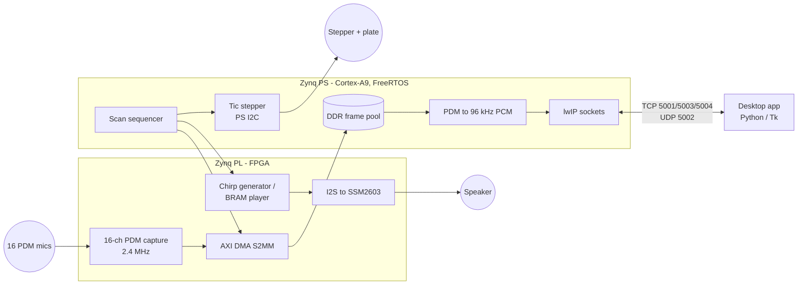

# Airborne Circular Sonar

An in-air acoustic scanner on a Digilent Zybo Z7-20 (Xilinx Zynq-7020). A
speaker emits a chirp, a 16-microphone PDM array records the echoes, and a
stepper motor rotates the array plate through one full revolution in a
user-chosen number of positions. Captures are buffered in DDR and streamed to a
desktop application over Ethernet.

## Measurement cycle

For each of the N positions per revolution (1–1000, chosen by the user):

1. Trigger playback and capture together (one FPGA GPIO edge).
2. Transmit a chirp (generated LFM sweep or uploaded WAV, up to 49 ms, 96 kHz)
   while all 16 microphones record 50 ms.
3. 2 s after the trigger, move the plate by 1/N of a revolution
   (19,902 Tic position units per 360°; moves are rounded so they sum exactly).
4. Wait 2 s after the motor reports completion, then repeat.

## Repository

| Directory | Content |
|---|---|
| [`hardware/`](hardware/README.md) | Vivado block design (Tcl), RTL, constraints, reproducible build, released XSA |
| [`firmware/`](firmware/README.md) | FreeRTOS application, host unit tests |
| [`gui/`](gui/README.md) | Desktop application for configuration, scan control and recording |

## Quick start

1. Program the board: build the platform and application in Vitis 2025.2 from
   `hardware/airborne_sonar.xsa` and `firmware/` (details in
   [firmware/README.md](firmware/README.md)), then run on `ps7_cortexa9_0`.
2. Connect the board's Ethernet port directly to the PC.
3. Start the GUI: `gui\Start_Sonar_GUI.cmd`, connect, apply a transmit
   setting, choose the number of positions and press **Start**.

## Engineering

- **Reproducible hardware:** `vivado -mode batch -source hardware/scripts/build.tcl`
  rebuilds the bitstream from sources, checks timing and exports the XSA.
- **Supervision:** a heartbeat monitor on the task that owns the actuators,
  backed by the Cortex-A9 private watchdog; outputs are safe even if that task
  stalls.
- **Loss-free transfer:** captures stay in a DDR slot until the
  host acknowledges the CRC-checked record.
- **Tests:** 92 host unit tests for the firmware (run under ASan/UBSan in CI)
  and 51 for the GUI; clang-format and cppcheck gates.

## License

GPL-3.0, see [LICENSE](LICENSE).
